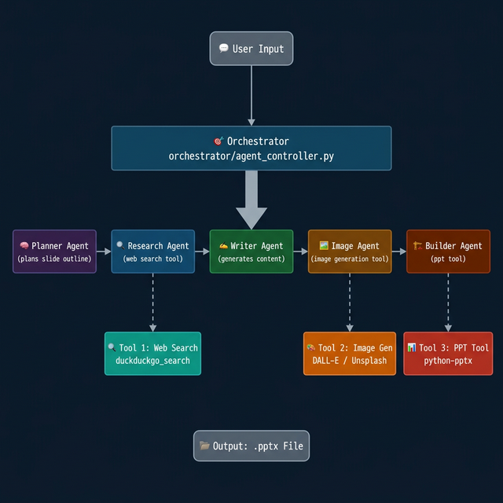

# 🤖 Agentic AI PowerPoint Builder

[](https://opensource.org/licenses/MIT)
[](https://www.python.org/)
[](https://streamlit.io/)
[](https://langchain-ai.github.io/langgraph/)

A production-ready, **multi-agent AI system** that autonomously researches, plans, writes, and builds professional PowerPoint presentations. Powered by **LangGraph**, **Groq (Llama 3.3-70B)**, **DuckDuckGo Search**, **DALL-E 3**, and **Streamlit**.

---

## 🏗 Architecture

The system operates as a **5-agent pipeline** managed by a central orchestrator:



```
User Input
    ↓
Orchestrator (orchestrator/agent_controller.py)
    ↓
PlannerAgent → ResearchAgent → WriterAgent → ImageAgent → BuilderAgent
                    ↓                              ↓                ↓
              [Tool 1: Web Search]    [Tool 2: Image Gen]   [Tool 3: PPT Tool]
                  DuckDuckGo            DALL-E / Unsplash      python-pptx
```

---

## 🤖 Agents

| # | Agent | Package | Role |
|---|---|---|---|
| 1 | **PlannerAgent** | `agents/planner/` | Converts topic + slide count into a structured JSON outline |
| 2 | **ResearchAgent** | `agents/research/` | Searches the web (DuckDuckGo) for factual slide content |
| 3 | **WriterAgent** | `agents/writer/` | Writes detailed bullet-point content enriched with research facts |
| 4 | **ImageAgent** | `agents/image/` | Generates or fetches an image per slide |
| 5 | **BuilderAgent** | `agents/builder/` | Assembles all data into a `.pptx` file |

Agents communicate exclusively through a shared **`AgentState`** TypedDict (see `state.py`). The **orchestrator** (`orchestrator/agent_controller.py`) manages the pipeline — agents are decoupled from each other.

---

## 🛠 Tools

| # | Tool | File | Purpose |
|---|---|---|---|
| 1 | **Web Search Tool** | `tools/web_search_tool.py` | DuckDuckGo search — no API key required. Falls back to empty on failure. |
| 2 | **Image Generation Tool** | `tools/image_generation_tool.py` | DALL-E 3 (primary) → Unsplash (fallback) → placeholder (final fallback) |
| 3 | **PPT Generation Tool** | `tools/ppt_tool.py` | Wraps `python-pptx` to build formatted `.pptx` files |

---

## 🚀 Features

- **5-Agent Multi-Agent Architecture** with clear role specialization
- **3 Integrated Tools** (web search, image generation, PPT generation)
- **Central Orchestrator** for a modular, maintainable pipeline
- **Human-in-the-loop**: Interactive Streamlit UI + CLI with explicit user control
- **Robust Error Handling**: `utils/error_handler.py` with `safe_run()`, `with_retry()`, fallback strategies
- **Disk Caching**: All LLM/API calls cached to reduce cost and latency on repeat runs
- **Structured Logging**: Comprehensive logging across all agents and tools
- **Full Test Suite**: 10 test files with pytest + pytest-mock

---

## 🛠 Installation

### Prerequisites

| Requirement | Notes |
|---|---|
| Python 3.10+ | Required |
| Groq API Key | **Required** — get at [console.groq.com](https://console.groq.com/) |
| OpenAI API Key | Optional — enables DALL-E 3 image generation |
| Unsplash Access Key | Optional — enables stock photo fetching |

### Setup

```bash
# 1. Clone the repository
git clone https://github.com/dharamshiyash/agentic-ppt-builder.git
cd agentic-ppt-builder

# 2. Create and activate virtual environment
python3 -m venv venv
source venv/bin/activate   # On Windows: venv\Scripts\activate

# 3. Install dependencies
pip install -r requirements.txt

# 4. Configure environment
cp .env.example .env
# Edit .env and add your API keys
```

Your `.env` file:
```ini
GROQ_API_KEY=gsk_...            # Required
UNSPLASH_ACCESS_KEY=...          # Optional
OPENAI_API_KEY=sk-...            # Optional
```

---

## ▶️ Usage

### Option 1 — Streamlit Web UI

```bash
streamlit run app.py
```

Then open [http://localhost:8501](http://localhost:8501) in your browser.

### Option 2 — Command Line

```bash
python main.py --topic "Artificial Intelligence in Healthcare"

# With options
python main.py --topic "Climate Change" --slides 8 --font Arial --depth Detailed
```

CLI options:

| Flag | Default | Description |
|---|---|---|
| `--topic` / `-t` | *(required)* | Presentation topic |
| `--slides` / `-s` | `7` | Number of slides |
| `--font` / `-f` | `Calibri` | Font (Arial, Calibri, Times New Roman, Consolas) |
| `--depth` / `-d` | `Concise` | Content depth (Minimal, Concise, Detailed) |

### Generated Output

Presentations are saved to the `outputs/` directory as `.pptx` files.

---

## 🧪 Testing

```bash
pytest tests/ -v
```

Test coverage:

| Test File | What It Tests |
|---|---|
| `test_planner.py` | PlannerAgent and outline service |
| `test_writer.py` | WriterAgent and content service |
| `test_image.py` | ImageAgent and fetch/keyword services |
| `test_ppt_builder.py` | BuilderAgent and PPTX creation |
| `test_research_agent.py` | ResearchAgent and web search integration |
| `test_web_search_tool.py` | Web search tool (DuckDuckGo) |
| `test_error_handler.py` | safe_run, with_retry, handle_agent_error |
| `test_integration.py` | Full pipeline integration |
| `test_async_queue.py` | Async queue / sync fallback |

---

## 📂 Project Structure

```
agentic-ppt-builder/
├── agents/
│   ├── planner/        # PlannerAgent — slide outline generation
│   ├── research/       # ResearchAgent — web research via DuckDuckGo
│   ├── writer/         # WriterAgent — slide content generation
│   ├── image/          # ImageAgent — image sourcing
│   └── builder/        # BuilderAgent — PPTX file assembly
├── tools/
│   ├── web_search_tool.py      # Tool 1: DuckDuckGo web search
│   ├── image_generation_tool.py # Tool 2: DALL-E / Unsplash image
│   ├── ppt_tool.py             # Tool 3: python-pptx generation
│   ├── cache.py                # Disk cache decorator
│   ├── retry.py                # Tenacity retry decorator
│   └── async_queue.py          # Redis/RQ async queue (optional)
├── orchestrator/
│   └── agent_controller.py    # Central pipeline manager
├── utils/
│   ├── config.py               # Environment & settings
│   ├── logger.py               # Structured logging
│   └── error_handler.py        # safe_run, with_retry, fallback helpers
├── docs/
│   ├── architecture_diagram.png
│   ├── current_system_report.md
│   └── improvement_report.md
├── tests/                      # pytest test suite
├── app.py                      # Streamlit UI entrypoint
├── main.py                     # CLI entrypoint
├── graph.py                    # LangGraph pipeline definition
├── state.py                    # AgentState TypedDict
├── requirements.txt
├── .env.example
└── LICENSE                     # MIT License
```

---

## 📜 License

This project is licensed under the [MIT License](LICENSE).

---

**Author**: Yash Dharamshi
