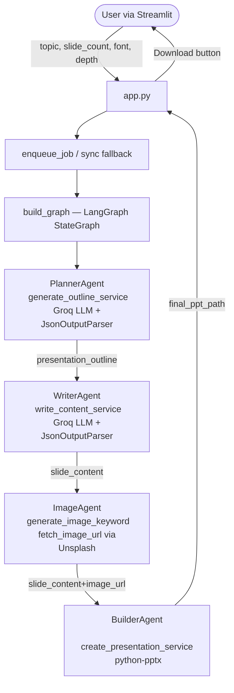

# Current System Report — Agentic AI PowerPoint Builder

## 1. Project Overview

The **Agentic AI PowerPoint Builder** is an autonomous multi-agent system that converts a user-supplied topic into a fully formatted `.pptx` presentation. It is built on **LangGraph** for orchestration, **Groq (Llama 3.3-70B)** as the LLM engine, and **python-pptx** for slide generation. The user interacts via a **Streamlit** web interface.

---

## 2. Current Agent Architecture

The system employs four specialized agents arranged in a linear LangGraph pipeline:

```
User Input (Streamlit)
         │
         ▼
  ┌─────────────┐
  │ PlannerAgent│  ← Converts topic into structured slide outline
  └──────┬──────┘
         │
         ▼
  ┌─────────────┐
  │ WriterAgent │  ← Writes detailed bullet-point content per slide
  └──────┬──────┘
         │
         ▼
  ┌─────────────┐
  │ ImageAgent  │  ← Fetches a stock image URL per slide (Unsplash)
  └──────┬──────┘
         │
         ▼
  ┌─────────────┐
  │ BuilderAgent│  ← Assembles all data into a .pptx file
  └──────┬──────┘
         │
         ▼
  Generated .pptx (downloadable via Streamlit)
```

### Agent Responsibilities

| Agent | File | Input | Output | LLM? |
|---|---|---|---|---|
| PlannerAgent | `agents/planner/` | topic, slide_count, depth | `presentation_outline` (list of {title, description}) | ✅ |
| WriterAgent | `agents/writer/` | `presentation_outline` | `slide_content` (list of {title, content, image_keyword, image_url}) | ✅ |
| ImageAgent | `agents/image/` | `slide_content[].title + .content` | `slide_content[].image_keyword`, `.image_url` | ✅ (keyword gen) + HTTP |
| BuilderAgent | `agents/builder/` | `slide_content`, font, output_path | `.pptx` file + `final_ppt_path` | ❌ |

### Agent Communication

Agents communicate exclusively through a shared **`AgentState`** TypedDict (`state.py`). LangGraph passes the state between nodes; each agent reads fields it needs and returns only the fields it modifies.

```python
class AgentState(TypedDict):
    topic: str
    slide_count: int
    font: str
    depth: str
    presentation_outline: List[Dict[str, str]]
    slide_content: List[SlideContent]
    final_ppt_path: str
```

---

## 3. Existing Tools Integrated

| Tool / Library | Purpose | File |
|---|---|---|
| **Groq (Llama 3.3-70B)** | LLM backbone for all text generation | `utils/config.py` → all agents |
| **Unsplash REST API** | Royalty-free stock image retrieval | `agents/image/service.py` |
| **python-pptx** | PPTX generation (slides, text, images) | `agents/builder/service.py` |
| **disk_cache** | Pickle-based disk cache for LLM/API results | `tools/cache.py` |
| **api_retry** (tenacity) | Exponential backoff retry on failures | `tools/retry.py` |
| **Redis/RQ** (optional) | Async job queue with sync fallback | `tools/async_queue.py` |

> **Note:** The `tools/` directory houses *infrastructure utilities* (cache, retry, async), **not** named task-specific tool modules. This is a gap relative to ReadyTensor's requirement for ≥3 integrated tools.

---

## 4. Workflow Diagram (Detailed)



---

## 5. Libraries Used

| Library | Version / Notes | Role |
|---|---|---|
| `langchain`, `langchain-groq` | Latest | LLM prompts, chains, parsers |
| `langgraph` | Latest | Multi-agent state graph orchestration |
| `python-pptx` | Latest | PPTX file generation |
| `streamlit` | Latest | Web UI |
| `tenacity` | Latest | Retry logic |
| `redis`, `rq` | Optional | Async job queue |
| `requests` | Latest | HTTP calls (Unsplash, image download) |
| `python-dotenv` | Latest | `.env` config loading |
| `pydantic` | Latest | Schema validation (PlannerOutput, WriterOutput) |
| `pytest`, `pytest-mock` | Latest | Test suite |

---

## 6. How the User Interacts

1. User opens the Streamlit app (`streamlit run app.py`)
2. Fills in: **Topic**, **Number of Slides**, **Font**, **Content Depth**, **Include Images** checkbox
3. Clicks **"Generate Presentation"**
4. A status panel shows agent progress
5. On success, a **Download .pptx** button appears

---

## 7. Current System Strengths

- ✅ **Clean agent separation**: Each agent has a single responsibility with `agent.py` + `service.py` + `schema.py` pattern.
- ✅ **Disk caching**: LLM and API calls are cached to disk, reducing costs and latency on repeat requests.
- ✅ **Retry resilience**: `tenacity`-based retry with exponential backoff applied to all service calls.
- ✅ **Async-ready**: Optional Redis/RQ job queue with transparent sync fallback.
- ✅ **Structured logging**: Centralized logger used throughout agents.
- ✅ **Configuration management**: Single `Config` class loads and validates environment variables.
- ✅ **Test suite**: Seven test files covering planner, writer, image, builder, integration, and async queue.

---

## 8. Gap Analysis — ReadyTensor Requirements

| Requirement | Current Status | Gap / Action Required |
|---|---|---|
| **Multi-agent architecture** | ✅ 4 agents (Planner, Writer, Image, Builder) | None — already compliant |
| **≥3 tools integrated** | ❌ 0 explicitly named tools; utilities only | Add `web_search_tool.py`, `image_generation_tool.py`, `ppt_tool.py` |
| **Clear agent role specialization** | ⚠️ Partial — ImageAgent mixes keyword-gen LLM with HTTP fetch | Add dedicated **ResearchAgent** for factual data gathering |
| **Human-in-the-loop interaction** | ⚠️ Streamlit form exists but not documented as HITL | Document in README; keep Streamlit form as HITL checkpoint |
| **Scalable and modular architecture** | ⚠️ Agents are coupled to `graph.py` directly | Add `orchestrator/agent_controller.py` as central manager |
| **LICENSE file** | ✅ MIT License present | None |
| **Clear documentation** | ⚠️ Partial — README lacks arch diagram, tool/agent tables, CLI usage | Rewrite README; add architecture diagram; add CLI `main.py` |
| **Error handling** | ⚠️ Partial — try/except in services but no centralized handler | Add `utils/error_handler.py` with fallback strategies |
